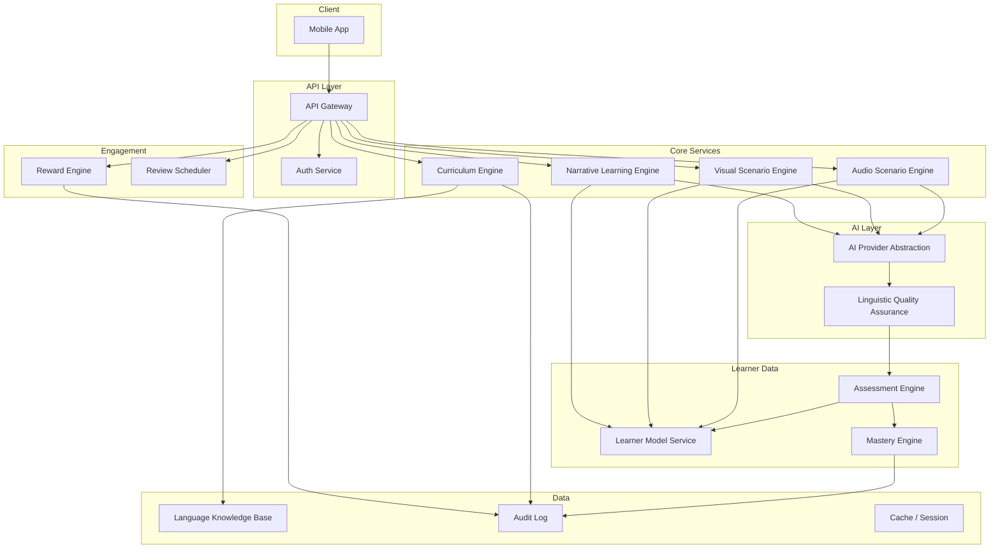
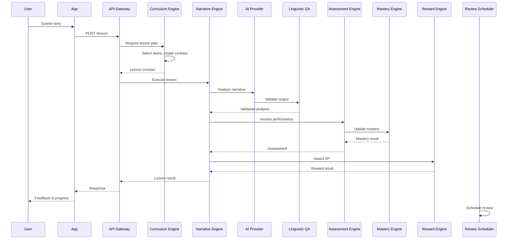
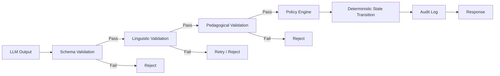
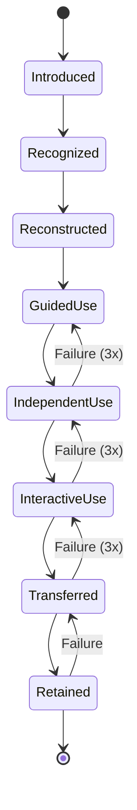

# System Architecture Diagram

```mermaid
graph TB
    subgraph "Client"
        APP[Mobile App]
    end

    subgraph "API Layer"
        GW[API Gateway]
        AUTH[Auth Service]
    end

    subgraph "Core Services"
        CE[Curriculum Engine]
        NLE[Narrative Learning Engine]
        VSE[Visual Scenario Engine]
        ASE[Audio Scenario Engine]
    end

    subgraph "Learner Data"
        LMS[Learner Model Service]
        AE[Assessment Engine]
        ME[Mastery Engine]
    end

    subgraph "Engagement"
        RE[Reward Engine]
        RS[Review Scheduler]
    end

    subgraph "AI Layer"
        AI[AI Provider Abstraction]
        LQA[Linguistic Quality Assurance]
    end

    subgraph "Data"
        LKB[Language Knowledge Base]
        AUDIT[Audit Log]
        CACHE[Cache / Session]
    end

    APP --> GW
    GW --> AUTH
    GW --> CE
    GW --> NLE
    GW --> VSE
    GW --> ASE
    GW --> RE
    GW --> RS

    NLE --> AI
    VSE --> AI
    ASE --> AI
    CE --> LKB

    NLE --> LMS
    VSE --> LMS
    ASE --> LMS
    AE --> LMS
    AE --> ME

    AI --> LQA
    LQA --> AE

    RE --> AUDIT
    CE --> AUDIT
    ME --> AUDIT
```

# Data Flow Diagram

```mermaid
sequenceDiagram
    participant U as User
    participant APP as App
    participant GW as API Gateway
    participant CE as Curriculum Engine
    participant NLE as Narrative Engine
    participant AI as AI Provider
    participant LQA as Linguistic QA
    participant AE as Assessment Engine
    participant ME as Mastery Engine
    participant RE as Reward Engine
    participant RS as Review Scheduler

    U->>APP: Submit story
    APP->>GW: POST /lesson
    GW->>CE: Request lesson plan
    CE->>CE: Select items, create contract
    CE-->>GW: Lesson contract
    GW->>NLE: Execute lesson
    NLE->>AI: Analyze narrative
    AI->>LQA: Validate output
    LQA-->>NLE: Validated analysis
    NLE->>AE: Assess performance
    AE->>ME: Update mastery
    ME-->>AE: Mastery result
    AE-->>NLE: Assessment
    NLE->>RE: Award XP
    RE-->>NLE: Reward result
    NLE-->>GW: Lesson result
    GW-->>APP: Response
    APP-->>U: Feedback & progress
    RS->>RS: Schedule review
```

# Validation Pipeline

```mermaid
flowchart LR
    A[LLM Output] --> B[Schema Validation]
    B -->|Pass| C[Linguistic Validation]
    B -->|Fail| R1[Reject]
    C -->|Pass| D[Pedagogical Validation]
    C -->|Fail| R2[Retry / Reject]
    D -->|Pass| E[Policy Engine]
    D -->|Fail| R3[Reject]
    E --> F[Deterministic State Transition]
    F --> G[Audit Log]
    G --> H[Response]
```

# Mastery State Machine

```mermaid
stateDiagram-v2
    [*] --> Introduced
    Introduced --> Recognized
    Recognized --> Reconstructed
    Reconstructed --> GuidedUse
    GuidedUse --> IndependentUse
    IndependentUse --> InteractiveUse
    InteractiveUse --> Transferred
    Transferred --> Retained
    Retained --> [*]

    IndependentUse --> GuidedUse: Failure (3x)
    InteractiveUse --> IndependentUse: Failure (3x)
    Transferred --> InteractiveUse: Failure (3x)
    Retained --> Transferred: Failure
```
