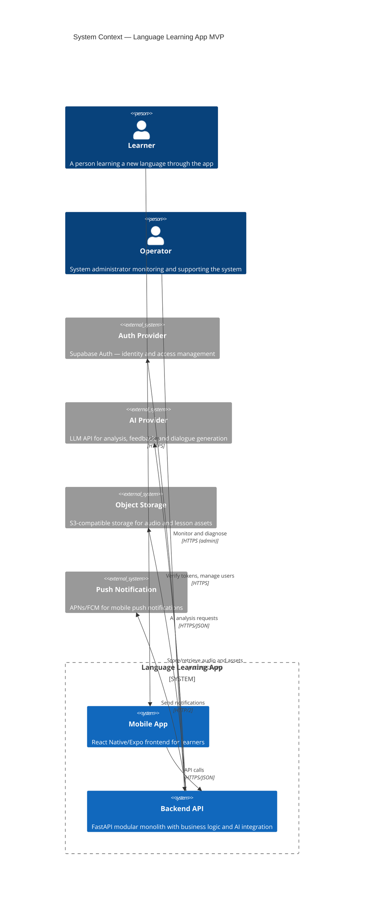

# System Context

**Status:** Draft  
**Version:** 1.0.0  
**Last updated:** 2026-06-10

---

## C4 Context Diagram



---

## External Actors

### 1. Learner
- Primary user of the system
- Interacts exclusively through the mobile app
- Expects responsive, private, and accurate learning experiences
- Has varying technical proficiency and accessibility needs

### 2. Operator / Admin
- System administrator with read-only diagnostic access
- Monitors system health, reviews audit logs, investigates issues
- Cannot modify learner data or trigger actions on behalf of learners

---

## External Systems

### 1. Auth Provider (Supabase Auth)
- **Purpose:** Identity management, authentication, OAuth social login
- **Data exchanged:** Email/password hashes, OAuth tokens, user identities
- **Protocol:** HTTPS REST API + client SDK
- **Dependency:** Critical for user access; outage prevents login but not necessarily active lessons (short grace period with cached tokens)
- **Data privacy:** Supabase processes authentication data only

### 2. AI Provider (LLM API)
- **Purpose:** Language analysis, feedback generation, dialogue simulation, prompt generation
- **Data exchanged:** Learner submissions (text/transcripts), lesson context, prompt templates; returned structured analysis
- **Protocol:** HTTPS REST API
- **Dependency:** Critical for AI-powered features; non-AI features (reviews, quiz, profile) degrade gracefully
- **Data privacy:** Learner submissions sent to provider; provider may process data on cross-border servers

### 3. Object Storage (MinIO / R2)
- **Purpose:** Storage for audio recordings, lesson images, content assets
- **Data exchanged:** Audio files (learner recordings), image assets (lesson content)
- **Protocol:** S3 API over HTTPS
- **Dependency:** High for audio lessons; content assets may be cached on device
- **Data privacy:** Audio recordings stored with access controls; bucket-per-learner isolation

### 4. Push Notification Service (APNs / FCM)
- **Purpose:** Send push notifications for review reminders and streak alerts
- **Data exchanged:** Device tokens, notification payloads
- **Protocol:** HTTP/2
- **Dependency:** Non-critical; app functions without notifications
- **Data privacy:** Device tokens stored; notification content limited to non-personal data

---

## System Boundary

The Language Learning App system encompasses:
- Mobile application (React Native/Expo)
- Backend API (FastAPI modular monolith)
- PostgreSQL database (primary data store)
- Redis cache and job queue
- AI Gateway abstraction layer

External to the system:
- Auth Provider, AI Provider, Object Storage, Push Notification Service
- Device hardware (microphone, speaker, storage)

---

## Primary Data Flows

### Learning Flow
```
Learner → Mobile App → Backend API → PostgreSQL (read lesson)
                                     → AI Gateway (generate prompt)
Backend API → Mobile App (display lesson)
Learner → Mobile App → Backend API → AI Gateway (analyze submission)
Backend API → PostgreSQL (store results, mastery, rewards)
Backend API → Mobile App (display feedback)
```

### Audit Flow
```
Backend API → Audit Module → PostgreSQL (audit_events table)
(Every state-changing operation triggers this flow)
```

### Notification Flow
```
Backend API → Arq Worker → Push Notification Service → Mobile App
```

---

## Technology Context

- **Mobile-to-Backend:** All communication via HTTPS REST API with JWT authentication
- **No direct external access:** Mobile app never calls AI Provider or Object Storage directly — all access through backend API
- **AI Gateway isolation:** Backend communicates with AI Provider only through the gateway abstraction layer
- **Auth delegation:** Backend verifies tokens with Auth Provider but user creation delegated to Auth Provider SDK
- **Local development:** MinIO for storage, no external dependencies beyond Docker Compose
