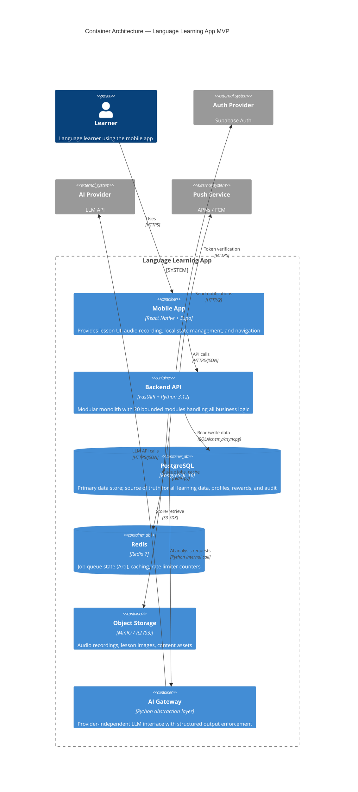

# Container Architecture

**Status:** Draft  
**Version:** 1.0.0  
**Last updated:** 2026-06-10

---

## C4 Container Diagram

---

## Container Details

### 1. Mobile App (React Native + Expo)

**Technology:** React Native 0.76+, Expo SDK 52+, TypeScript 5.x  
**Responsibility:** Provide the learner-facing interface for all app features

**Key Libraries:**
- Expo Router v4 — file-based navigation
- TanStack Query v5 — server state management, caching
- Zustand — client-side state (UI state, local preferences)
- React Hook Form + Zod — form handling with schema validation
- expo-av — audio playback and recording

**Interfaces:**
- HTTPS REST API → Backend API (all business operations)
- Local storage (AsyncStorage) → offline preferences and cached data
- Device APIs → camera, microphone, notifications

**Data Storage:** No persistent business data stored on device; all authoritative data in PostgreSQL. Local cache for UI performance (lesson history preview, last session state).

**Scaling Approach:** Single mobile app per device. No horizontal scaling needed. OTA updates via EAS Update for rapid iteration.

---

### 2. Backend API (FastAPI Modular Monolith)

**Technology:** FastAPI, Python 3.12+, Pydantic v2, SQLAlchemy 2.0  
**Responsibility:** All business logic as 20 bounded modules

**Key Components:**
- FastAPI application with APIRouter modules
- Pydantic v2 models for request/response validation
- SQLAlchemy 2.0 async ORM for database access
- Arq worker processes for background job processing
- OpenTelemetry instrumentation for observability
- Dependency injection container for module wiring

**Interfaces:**
- REST API (inbound) — mobile app requests
- SQLAlchemy (outbound) — PostgreSQL
- redis-py (outbound) — Redis for queue/cache
- AI Gateway (internal) — structured LLM calls
- S3 SDK (outbound) — object storage
- Auth SDK (outbound) — token verification

**Data Storage:** Stateless by design; all state in PostgreSQL. Session data passed via client token.

**Scaling Approach:** Horizontal scaling via multiple container instances behind load balancer. No sticky sessions required. Arq worker scaled independently.

---

### 3. PostgreSQL Database

**Technology:** PostgreSQL 16  
**Responsibility:** Primary data store, source of truth

**Key Configurations:**
- Extensions: pgcrypto (UUID generation), pg_trgm (text search)
- Connection pooling: PgBouncer or built-in pooling (max 20 connections per API instance)
- Backup: Automated pg_dump daily, WAL archiving for point-in-time recovery

**Data at Rest Encryption:** Enabled via filesystem encryption or cloud provider encryption

**Scaling Approach:** Vertical scaling for MVP (single primary). Read replicas considered post-MVP. Logical partitioning for audit events by month.

---

### 4. Redis

**Technology:** Redis 7  
**Responsibility:** Job queue state for Arq, cache for API responses, rate limiter counters

**Data:** Transient only. No persistent business data stored in Redis. Arq job data persisted via job result storage in PostgreSQL.

**Scaling Approach:** Single Redis instance sufficient for MVP. Redis Cluster considered post-MVP.

---

### 5. Object Storage

**Technology:** MinIO (local), Cloudflare R2 (staging)  
**Responsibility:** Storage and retrieval of audio recordings, lesson images, content assets

**Data Organization:**
- `audio/recordings/{user_id}/{session_id}.mp4` — learner audio submissions
- `audio/narratives/{lesson_id}.mp3` — lesson audio content
- `images/lessons/{lesson_id}.jpg` — visual scene images

**Access Control:** Pre-signed URLs for direct mobile access (generated by backend with time-limited expiry).

---

### 6. AI Gateway

**Technology:** Python abstraction layer within the backend process  
**Responsibility:** Provider-independent interface for all LLM operations

**Key Functions:**
- generate_structured_response(prompt, schema) → validated structured output
- analyze_text(text, context) → text analysis with corrections
- analyze_transcript(transcript, original) → comprehension analysis
- generate_dialogue_turn(context, user_input) → dialogue response
- generate_feedback(analysis, learner_level) → pedagogical feedback

**Cross-Cutting:**
- Structured output enforcement (JSON Schema validation post-LLM)
- Provider failover (primary → fallback → error)
- Cost tracking (per-request token counting)
- Latency tracking (OpenTelemetry span per request)
- Prompt version tracking (hash in audit event)

---

## Inter-Container Communication

| From | To | Protocol | Purpose | Security |
|------|----|----------|---------|----------|
| Mobile App | Backend API | HTTPS REST | All business operations | JWT Bearer token |
| Backend API | PostgreSQL | SQLAlchemy/asyncpg | Data persistence | TLS + password auth |
| Backend API | Redis | redis-py with TLS | Queue + cache | Password auth |
| Backend API | AI Gateway | In-process Python call | LLM operations | Internal only |
| AI Gateway | AI Provider | HTTPS REST | LLM API calls | API key header |
| Backend API | Object Storage | S3 HTTPS API | File storage | Access key + secret |
| Backend API | Auth Provider | HTTPS REST | Token verification | Service role key |

---

## Security Boundaries

1. **Mobile ↔ Backend:** JWT-authenticated, HTTPS-only, rate-limited
2. **Backend ↔ External:** All external calls authenticated; no direct external access from mobile
3. **AI Gateway:** Only the gateway module communicates with AI providers; no other module has LLM access
4. **Audit:** Audit module receives events from all modules but maintains write-only append semantics
