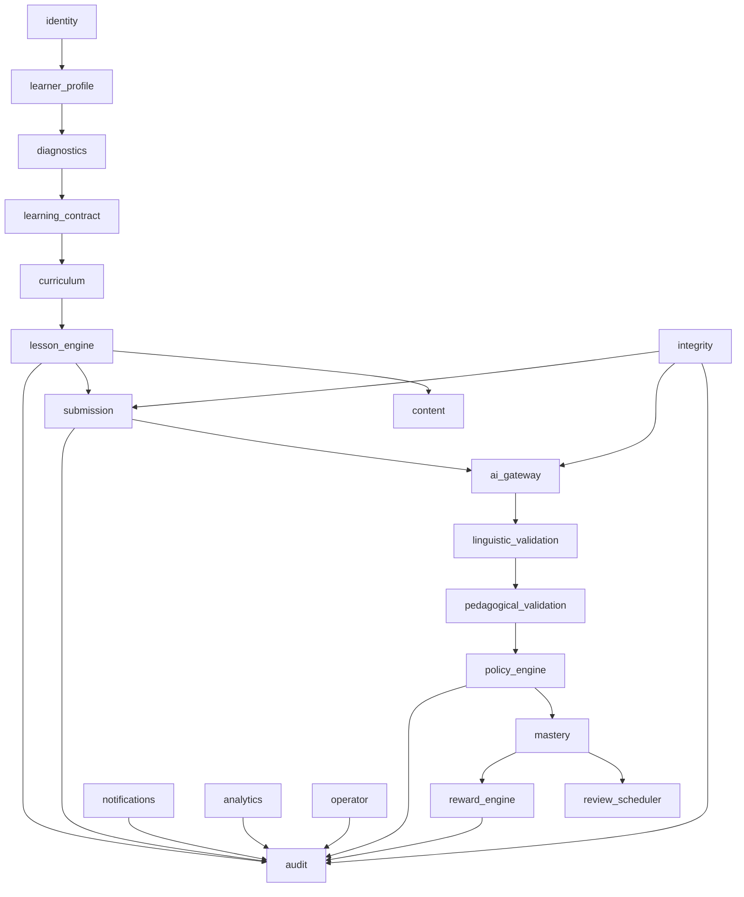

# Module Architecture

**Status:** Draft  
**Version:** 1.0.0  
**Last updated:** 2026-06-10

---

## Architecture Style: Modular Monolith

The MVP uses a **modular monolith** architecture — a single deployment unit (one FastAPI process) containing 20 bounded modules with clear interface contracts. Modules communicate through Python function calls (not HTTP), but are architecturally separated and could be extracted into microservices if needed post-MVP.

**Why not microservices:**
- MVP has fewer than 10 developers; microservices overhead is unjustified
- Most operations span 2-3 modules; in-process calls are simpler and faster
- Single database transaction covers most operations; distributed transactions add complexity
- Module boundaries enforce separation without network overhead

**Module dependency rule:** Modules may depend on interfaces of other modules but never on internal implementation. Circular dependencies are forbidden.

---

## Module Dependency Diagram

---

## Module Definitions

### 1. identity
**Responsibility:** User registration, authentication, and identity management. Delegates auth to Supabase Auth; manages local user records.
**Owned Entities:** User, AuthIdentity
**Exposed Interfaces:** register_user(), authenticate(), verify_token(), refresh_token()
**Consumed Interfaces:** None (external: Supabase Auth SDK)
**Forbidden:** Must not access learner profile data; must not manage rewards
**State Transitions:** User: pending → active → suspended → deleted
**Failure Behaviour:** Auth provider errors surface as 401/403
**Events Emitted:** user.registered, user.deleted, user.suspended
**Observability:** auth_latency, auth_failure_rate

### 2. learner_profile
**Responsibility:** Manages the multidimensional learner profile including skill dimensions, language preferences, goals, and progression state.
**Owned Entities:** LearnerProfile, SkillDimension, XPBalance
**Exposed Interfaces:** get_profile(), update_profile(), get_skill_dimensions()
**Consumed Interfaces:** identity.get_user(), diagnostics.get_assessment(), mastery.get_mastery_records()
**Forbidden:** Must not award rewards or XP; must not modify lesson content
**State Transitions:** Profile: created → active → dormant → archived
**Failure Behaviour:** Returns cached profile if DB unavailable
**Events Emitted:** profile.created, profile.updated, profile.dormant
**Observability:** profile_read_latency, profile_update_count

### 3. diagnostics
**Responsibility:** Manages diagnostic sessions, question delivery, response collection, and skill assessment computation.
**Owned Entities:** DiagnosticSession, DiagnosticResponse, SkillAssessment
**Exposed Interfaces:** create_session(), submit_response(), complete_session(), get_assessment()
**Consumed Interfaces:** learner_profile.get_profile(), mastery.get_mastery_records()
**Forbidden:** Must not modify mastery directly; must not award rewards
**State Transitions:** DiagnosticSession: created → active → completed → expired
**Events Emitted:** diagnostic.started, diagnostic.response_recorded, diagnostic.completed
**Observability:** diagnostic_duration, diagnostic_completion_rate

### 4. learning_contract
**Responsibility:** Manages the Learning Entry Contract lifecycle including creation, review, and updates.
**Owned Entities:** LearningEntryContract
**Exposed Interfaces:** create_contract(), get_current_contract(), update_contract(), validate_contract()
**Consumed Interfaces:** diagnostics.get_assessment(), learner_profile.get_profile()
**Forbidden:** Must not modify lesson content or progress
**Failure Behaviour:** Invalid contract rejected with validation errors
**Events Emitted:** contract.created, contract.updated, contract.expired
**Observability:** contract_creation_count, contract_renewal_rate

### 5. curriculum
**Responsibility:** Lesson selection, recommendation, and curriculum progression management.
**Owned Entities:** LessonDefinition
**Exposed Interfaces:** get_available_lessons(), get_recommended_lesson(), get_lesson()
**Consumed Interfaces:** learner_profile.get_profile(), mastery.get_mastery_records(), learning_contract.get_current_contract()
**Forbidden:** Must not generate lesson content (delegates to content module); must not modify learner profile
**Failure Behaviour:** Lesson unavailable returns 404 with alternatives
**Events Emitted:** lesson.recommended
**Observability:** lesson_selection_count, recommendation_acceptance_rate

### 6. lesson_engine
**Responsibility:** Orchestrates lesson session lifecycle from creation through completion. Manages lesson state, attempts, and completion flow.
**Owned Entities:** LessonSession, LessonAttempt
**Exposed Interfaces:** create_session(), get_session(), submit_attempt(), complete_session()
**Consumed Interfaces:** curriculum.get_lesson(), content.get_content(), submission.accept_submission(), mastery.record_evidence()
**Forbidden:** Must not directly call AI Gateway; must not award rewards
**State Transitions:** LessonSession: created → active → paused → submitting → completed | failed | abandoned
**Events Emitted:** lesson_session.created, lesson_session.attempted, lesson_session.completed, lesson_session.failed
**Observability:** lesson_duration, lesson_completion_rate, lesson_retry_rate

### 7. content
**Responsibility:** Manages lesson content including prompts, images, audio narratives, and scenario definitions.
**Owned Entities:** ContentVersion
**Exposed Interfaces:** get_lesson_content(), get_image(), get_audio_narrative(), get_scenario()
**Consumed Interfaces:** learner_profile.get_profile()
**Forbidden:** Must not modify lesson sessions or learner data
**Failure Behaviour:** Content not found returns 404 with fallback content suggestion
**Events Emitted:** content.delivered, content.version_changed
**Observability:** content_load_latency, content_cache_hit_rate

### 8. submission
**Responsibility:** Accepts, validates, and processes learner submissions (text and audio).
**Owned Entities:** Submission
**Exposed Interfaces:** submit_text(), submit_audio(), get_submission(), get_analysis()
**Consumed Interfaces:** integrity.scan_input(), ai_gateway.analyze_text()/analyze_transcript()
**Forbidden:** Must not modify mastery, rewards, or review schedule
**State Transitions:** Submission: created → validated → analyzing → completed | rejected | failed
**Events Emitted:** submission.received, submission.validated, submission.analysis_complete
**Observability:** submission_count, submission_validation_failure_rate

### 9. ai_gateway (AI Gateway)
**Responsibility:** Provider-independent interface for all LLM operations with structured output enforcement, validation, and audit.
**Owned Entities:** AIAnalysisRequest, AIAnalysisResult, PromptTemplateVersion
**Exposed Interfaces:** generate_structured_response(), analyze_text(), analyze_transcript(), generate_dialogue_turn(), generate_feedback()
**Consumed Interfaces:** None (external: LLM Provider API)
**Forbidden:** LLM output must not directly modify any system state; structured output only
**State Transitions:** AIAnalysisRequest: pending → processing → validating → completed | failed | rejected
**Events Emitted:** ai_analysis.started, ai_analysis.completed, ai_analysis.failed, ai_analysis.rejected
**Observability:** llm_latency, llm_failure_rate, llm_cost_per_request, llm_token_count

### 10. linguistic_validation
**Responsibility:** Validates AI analysis output for linguistic accuracy and appropriateness.
**Owned Entities:** ValidationResult
**Exposed Interfaces:** validate_analysis(), validate_corrections(), validate_feedback()
**Consumed Interfaces:** policy_engine.check_policy()
**Forbidden:** Must not modify AI output; only pass/fail with reasons
**Failure Behaviour:** Linguistic validation failure triggers pedagogical review
**Events Emitted:** validation.linguistic_passed, validation.linguistic_failed
**Observability:** linguistic_validation_pass_rate, linguistic_validation_latency

### 11. pedagogical_validation
**Responsibility:** Validates that AI feedback and analysis are appropriate for the learner's level and pedagogical approach.
**Owned Entities:** ValidationResult
**Exposed Interfaces:** validate_for_level(), validate_feedback_appropriateness(), validate_cognitive_load()
**Consumed Interfaces:** learner_profile.get_profile(), mastery.get_mastery_records()
**Forbidden:** Must not modify AI output; only pass/fail with reasons
**Failure Behaviour:** Pedagogical failure triggers retry gate evaluation
**Events Emitted:** validation.pedagogical_passed, validation.pedagogical_failed
**Observability:** pedagogical_validation_pass_rate, pedagogical_rejection_reason

### 12. policy_engine
**Responsibility:** Central policy decision point — evaluates all validation results and determines if the system should proceed with state changes.
**Owned Entities:** None (stateless decision engine)
**Exposed Interfaces:** evaluate_lesson_completion(), evaluate_retry_eligibility(), evaluate_reward_eligibility()
**Consumed Interfaces:** linguistic_validation, pedagogical_validation, integrity_checks
**Forbidden:** Must not modify any state directly; returns decisions only
**Failure Behaviour:** Policy rejection surfaces as actionable error
**Events Emitted:** policy.lesson_approved, policy.lesson_rejected, policy.retry_granted, policy.retry_denied
**Observability:** policy_decision_count, policy_rejection_rate, policy_decision_latency

### 13. mastery
**Responsibility:** Manages mastery records, mastery evidence, and deterministic mastery state transitions.
**Owned Entities:** MasteryRecord, MasteryEvidence
**Exposed Interfaces:** record_evidence(), get_mastery_profile(), check_level_up()
**Consumed Interfaces:** learner_profile.get_profile(), policy_engine.evaluate_lesson_completion()
**Forbidden:** LLM must not influence mastery state transitions; rewards must not modify mastery
**State Transitions:** MasteryRecord: accumulating → threshold_reached → level_up → confirmed
**Events Emitted:** mastery.evidence_recorded, mastery.level_up, mastery.stalled
**Observability:** mastery_level_count, mastery_progression_rate

### 14. review_scheduler
**Responsibility:** Spaced repetition scheduling, review item management, and due review calculation.
**Owned Entities:** ReviewItem, ReviewSchedule
**Exposed Interfaces:** get_due_reviews(), process_attempt(), update_schedule(), create_review_items()
**Consumed Interfaces:** mastery.get_mastery_profile()
**Forbidden:** Must not award rewards; must not modify mastery
**State Transitions:** ReviewItem: active → reviewing → mastered | expired
**Events Emitted:** review.due, review.completed, review.schedule_updated
**Observability:** review_count, review_completion_rate, review_accuracy

### 15. reward_engine
**Responsibility:** Deterministic reward calculation, XP ledger management, and achievement tracking.
**Owned Entities:** RewardTransaction, XPBalance
**Exposed Interfaces:** award_xp(), get_ledger(), get_achievements(), check_achievement_milestones()
**Consumed Interfaces:** mastery.get_mastery_profile(), learner_profile.get_profile()
**Forbidden:** **LLM MUST NEVER INFLUENCE REWARDS** — all reward logic is deterministic
**State Transitions:** RewardTransaction: initiated → validated → committed → failed
**Events Emitted:** reward.xp_awarded, reward.achievement_unlocked, reward.duplicate_attempt_blocked
**Observability:** reward_xp_count, reward_failure_rate, reward_duplicate_attempts

### 16. notifications
**Responsibility:** Push notification scheduling, delivery, and preference management.
**Owned Entities:** Notification
**Exposed Interfaces:** send_notification(), get_notifications(), mark_read(), get_preferences()
**Consumed Interfaces:** learner_profile.get_profile()
**Failure Behaviour:** Notification send failure logged but not retried (best-effort)
**Events Emitted:** notification.sent, notification.read
**Observability:** notification_send_count, notification_failure_rate

### 17. analytics
**Responsibility:** Learning analytics computation, aggregation, and reporting.
**Owned Entities:** None (reads from audit and other entities)
**Exposed Interfaces:** get_analytics(), get_progress_report()
**Consumed Interfaces:** audit.query_events(), mastery.get_mastery_profile(), learner_profile.get_profile()
**Forbidden:** Must not modify any data; read-only module
**Failure Behaviour:** Analytics unavailable returns cached last-known values
**Observability:** analytics_query_latency

### 18. audit
**Responsibility:** Immutable audit event logging, query, and retention management.
**Owned Entities:** AuditEvent
**Exposed Interfaces:** record_event(), query_events(), get_retention_status()
**Consumed Interfaces:** None (all modules write to audit)
**Forbidden:** Audit events must never be modified or deleted (append-only)
**Failure Behaviour:** Audit write failure must log to stdout and trigger alert; system may proceed but risk of untracked state
**Observability:** audit_event_count, audit_write_latency, audit_write_failure

### 19. integrity
**Responsibility:** Security scanning, anti-cheat detection, duplicate detection, rate limiting, and abuse prevention.
**Owned Entities:** SecurityEvent, IntegrityRiskSignal
**Exposed Interfaces:** scan_input(), check_duplicate(), check_rate_limit(), report_signal()
**Consumed Interfaces:** None
**Forbidden:** Must not modify learner state; read-only checks
**Events Emitted:** integrity.threat_detected, integrity.duplicate_attempt, integrity.rate_limit_hit
**Observability:** security_event_count, duplicate_attempt_count, rate_limit_hit_count

### 20. operator
**Responsibility:** Operator/admin read-only tools for system diagnostics and user support.
**Owned Entities:** None
**Exposed Interfaces:** get_health(), get_user_diagnostics(), get_audit_log()
**Consumed Interfaces:** audit.query_events(), diagnostics.get_assessment(), learner_profile.get_profile()
**Forbidden:** Must not modify any data; read-only access
**Events Emitted:** operator.diagnostic_view
**Observability:** operator_action_count
