# Processing Pipeline

**Status:** Draft  
**Version:** 1.0.0  
**Last updated:** 2026-06-10

---

## Pipeline Overview

The processing pipeline defines the fixed sequence of steps that every learner submission passes through, from initial input to final response. This pipeline ensures deterministic behavior, comprehensive validation, and complete auditability.

```
User Input → Input Normalization → Security/Injection Scan → Request Schema Validation 
→ Lesson Context Binding → LLM Proposal → Output Schema Validation → Linguistic Validation 
→ Pedagogical Validation → Policy Engine → Deterministic State Transition 
→ Mastery Evidence Write → Review Scheduling → Reward Transaction → Audit Event → Response Assembly
```

**Key principles:**
- Every step has defined input, output, timeout, and failure behavior
- LLM is a proposer only; all acceptance decisions are deterministic
- Blind retry is forbidden — retries require classified cause
- Pipeline failure at any step blocks downstream actions
- Every step generates an audit event

---

## Pipeline Diagram

```mermaid
flowchart LR
    A[User Input] --> B[Input Normalization]
    B --> C[Security/Injection Scan]
    C --> D[Request Schema Validation]
    D --> E[Lesson Context Binding]
    E --> F[LLM Proposal]
    F --> G[Output Schema Validation]
    G --> H[Linguistic Validation]
    H --> I[Pedagogical Validation]
    I --> J[Policy Engine]
    J --> K[Deterministic State Transition]
    K --> L[Mastery Evidence Write]
    L --> M[Review Scheduling]
    M --> N[Reward Transaction]
    N --> O[Audit Event]
    O --> P[Response Assembly]

    C -.->|FAIL| X[Return Error]
    D -.->|FAIL| X
    G -.->|FAIL| Y[Retry Gate]
    H -.->|FAIL| Y
    I -.->|FAIL| Y
    Y -.->|Retry Allowed| F
    Y -.->|Max Retries| Z[Return Failure]
```



---

## Step Definitions

### Step 1: Input Normalization

| Property | Value |
|----------|-------|
| **Input** | Raw user input (text string or audio file reference) |
| **Output** | Normalized text (UTF-8, trimmed, NFC-normalized) |
| **Owner** | submission module |
| **Timeout** | 100ms |
| **Retry Policy** | No retry (deterministic, idempotent) |
| **Idempotency** | Idempotent — same input always produces same normalized output |
| **Failure State** | Submission → rejected (if unprocessable input) |
| **Audit Event** | submission.normalized |

### Step 2: Security/Injection Scan

| Property | Value |
|----------|-------|
| **Input** | Normalized text |
| **Output** | Scan result (pass/fail with classified threat type) |
| **Owner** | integrity module |
| **Timeout** | 200ms |
| **Retry Policy** | No retry |
| **Idempotency** | Idempotent |
| **Failure State** | Submission → rejected, SecurityEvent created |
| **Audit Event** | security.scan_completed |

### Step 3: Request Schema Validation

| Property | Value |
|----------|-------|
| **Input** | Normalized and scanned input |
| **Output** | Validated request object (Pydantic model) |
| **Owner** | submission module |
| **Timeout** | 50ms |
| **Retry Policy** | No retry |
| **Idempotency** | Idempotent |
| **Failure State** | Submission → rejected (validation error returned) |
| **Audit Event** | submission.schema_validated |

### Step 4: Lesson Context Binding

| Property | Value |
|----------|-------|
| **Input** | Validated submission + lesson session data |
| **Output** | Context-enriched analysis request (submission + lesson type + learner level + prompt) |
| **Owner** | lesson_engine module |
| **Timeout** | 100ms |
| **Retry Policy** | No retry |
| **Idempotency** | Idempotent |
| **Failure State** | Analysis request → failed (context binding error) |
| **Audit Event** | analysis.context_bound |

### Step 5: LLM Proposal

| Property | Value |
|----------|-------|
| **Input** | Context-enriched analysis request |
| **Output** | Raw LLM response (unvalidated structured data) |
| **Owner** | ai_gateway module |
| **Timeout** | 10,000ms (10s, provisional) |
| **Retry Policy** | Retry up to 2 times with fallback provider; blind retry FORBIDDEN — retry only on classified cause (timeout, 5xx, rate limit) |
| **Idempotency** | Non-idempotent — LLM may produce different output for same input |
| **Failure State** | AIAnalysisRequest → failed (if all retries exhausted) |
| **Audit Event** | ai_analysis.proposed |
| **Note** | THIS IS A PROPOSAL — not accepted until validated |

### Step 6: Output Schema Validation

| Property | Value |
|----------|-------|
| **Input** | Raw LLM response |
| **Output** | Schema-validated structured analysis (or rejection) |
| **Owner** | ai_gateway module |
| **Timeout** | 100ms |
| **Retry Policy** | No retry — schema failure is retryable at Step 5 (Retry Gate) |
| **Idempotency** | Idempotent |
| **Failure State** | AIAnalysisResult → rejected (malformed output) |
| **Audit Event** | validation.schema_check_completed |

### Step 7: Linguistic Validation

| Property | Value |
|----------|-------|
| **Input** | Schema-validated analysis |
| **Output** | Linguistic validation result (pass/fail with details) |
| **Owner** | linguistic_validation module |
| **Timeout** | 500ms |
| **Retry Policy** | No retry |
| **Idempotency** | Idempotent |
| **Failure State** | ValidationResult → failed (linguistic rejection) |
| **Audit Event** | validation.linguistic_completed |

### Step 8: Pedagogical Validation

| Property | Value |
|----------|-------|
| **Input** | Schema-validated + linguistically validated analysis |
| **Output** | Pedagogical validation result (pass/fail with details) |
| **Owner** | pedagogical_validation module |
| **Timeout** | 500ms |
| **Retry Policy** | No retry |
| **Idempotency** | Idempotent |
| **Failure State** | ValidationResult → failed (pedagogical rejection) |
| **Audit Event** | validation.pedagogical_completed |

### Step 9: Policy Engine

| Property | Value |
|----------|-------|
| **Input** | All validation results + lesson context |
| **Output** | Policy decision (approve/reject/retry) |
| **Owner** | policy_engine module |
| **Timeout** | 200ms |
| **Retry Policy** | No retry |
| **Idempotency** | Idempotent |
| **Failure State** | Returns decision — does not modify state |
| **Audit Event** | policy.decision_made |
| **Note** | If retry recommended, evaluates Retry Gate (see 13_dangerous_action_gates.md) |

### Step 10: Deterministic State Transition

| Property | Value |
|----------|-------|
| **Input** | Policy decision + lesson session |
| **Output** | Updated lesson session state (completed/failed) |
| **Owner** | lesson_engine module |
| **Timeout** | 200ms |
| **Retry Policy** | No retry (idempotent) |
| **Idempotency** | Idempotent (state based on idempotency key) |
| **Failure State** | LessonSession → failed (state transition error) |
| **Audit Event** | lesson_session.state_transitioned |

### Step 11: Mastery Evidence Write

| Property | Value |
|----------|-------|
| **Input** | Completed lesson session + analysis + performance data |
| **Output** | Mastery evidence record |
| **Owner** | mastery module |
| **Timeout** | 300ms |
| **Retry Policy** | Retry 1 time (DB write) |
| **Idempotency** | Idempotent (evidence deduplicated by session ID) |
| **Failure State** | MasteryEvidence → write pending (queued for retry) |
| **Audit Event** | mastery.evidence_recorded |

### Step 12: Review Scheduling

| Property | Value |
|----------|-------|
| **Input** | Analysis results (errors, target items) |
| **Output** | Review items created with initial schedule |
| **Owner** | review_scheduler module |
| **Timeout** | 200ms |
| **Retry Policy** | Retry 1 time (DB write) |
| **Idempotency** | Idempotent (review items deduplicated by session + item key) |
| **Failure State** | ReviewItem → schedule pending (queued) |
| **Audit Event** | review.items_scheduled |

### Step 13: Reward Transaction

| Property | Value |
|----------|-------|
| **Input** | Lesson completion + mastery update |
| **Output** | XP reward transaction |
| **Owner** | reward_engine module |
| **Timeout** | 200ms |
| **Retry Policy** | No retry — duplicate detection prevents double credit |
| **Idempotency** | Idempotent (idempotency key per lesson session) |
| **Failure State** | RewardTransaction → failed (retry on next request with same idempotency key) |
| **Audit Event** | reward.transaction_recorded |

### Step 14: Audit Event

| Property | Value |
|----------|-------|
| **Input** | All previous step results |
| **Output** | Complete audit event for the pipeline run |
| **Owner** | audit module |
| **Timeout** | 100ms |
| **Retry Policy** | Log to stdout + queue for async retry if DB write fails |
| **Idempotency** | Idempotent (event deduplicated by pipeline run ID) |
| **Failure State** | AuditEvent → write pending (alert triggered) |
| **Audit Event** | pipeline.audit_completed |

### Step 15: Response Assembly

| Property | Value |
|----------|-------|
| **Input** | All step outputs |
| **Output** | Final API response to mobile client |
| **Owner** | lesson_engine module |
| **Timeout** | 100ms |
| **Retry Policy** | No retry |
| **Idempotency** | Idempotent |
| **Failure State** | Response assembly failure → returns 500 with retryable=true |
| **Audit Event** | No additional event (pipeline already logged) |

---

## Retry Governance

### Blind Retry Prohibition
**Blind retry is strictly forbidden.** Every retry must have a **classified cause** (one of): timeout, provider 5xx, provider rate limit, network error, schema validation failure (if LLM output), invalid response format.

### Classified Retry Causes
| Cause | Retryable | Max Retries | Backoff | Fallback |
|-------|-----------|-------------|---------|----------|
| Timeout | Yes | 2 | 1s, 3s exponential | Fallback provider on 2nd retry |
| Provider 5xx | Yes | 2 | 2s, 5s | Fallback provider immediately |
| Provider rate limit | Yes | 2 | 5s, 10s | Fallback provider on 2nd retry |
| Network error | Yes | 2 | 1s, 3s | Fallback provider on 2nd retry |
| Schema validation failure | Yes (LLM) | 2 | Immediate | Regenerate with same provider |
| Pedagogical rejection | No | 0 | — | User receives improvement feedback |
| Linguistic rejection | No | 0 | — | User receives improvement feedback |
| Security scan failure | No | 0 | — | Input rejected, security event logged |

### Auto-Classification Requirement
Any step that initiates a retry MUST log: retry_cause (classified), retry_count (current), max_retries (limit), fallback_used (boolean).

---

## Pipeline Audit Event Structure

```json
{
  "pipeline_run_id": "uuid",
  "submission_id": "uuid",
  "lesson_session_id": "uuid",
  "trace_id": "uuid",
  "steps": [
    {"name": "input_normalization", "status": "passed", "duration_ms": 15},
    {"name": "security_scan", "status": "passed", "duration_ms": 42},
    {"name": "schema_validation", "status": "passed", "duration_ms": 8},
    {"name": "context_binding", "status": "passed", "duration_ms": 12},
    {"name": "llm_proposal", "status": "passed", "duration_ms": 3450, "provider": "primary", "retry_count": 0},
    {"name": "output_validation", "status": "passed", "duration_ms": 23},
    {"name": "linguistic_validation", "status": "passed", "duration_ms": 156},
    {"name": "pedagogical_validation", "status": "passed", "duration_ms": 134},
    {"name": "policy_engine", "status": "approved", "duration_ms": 5},
    {"name": "state_transition", "status": "completed", "duration_ms": 22},
    {"name": "mastery_evidence", "status": "recorded", "duration_ms": 18},
    {"name": "review_scheduling", "status": "scheduled", "duration_ms": 15},
    {"name": "reward_transaction", "status": "committed", "duration_ms": 12},
    {"name": "audit_event", "status": "recorded", "duration_ms": 8}
  ],
  "total_duration_ms": 3920,
  "result": "accepted"
}
```
