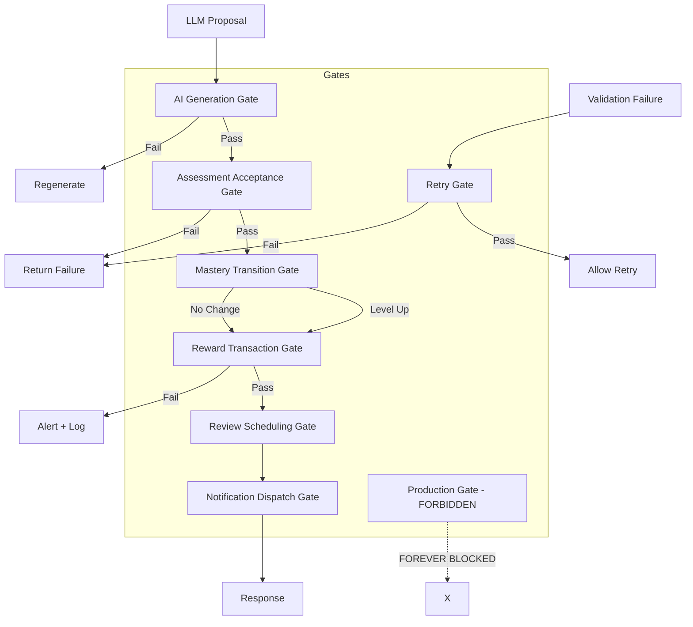

# Dangerous Action Gates

**Status:** Draft  
**Version:** 1.0.0  
**Last updated:** 2026-06-10

---

## Overview

Dangerous Action Gates are control points that prevent the system from performing irreversible or risky operations without meeting strict preconditions. Each gate has defined entry conditions, pass/fail criteria, and consequences.

### Core Rules

1. **Generation != Acceptance** — LLM may propose but only deterministic validation may accept
2. **Technical parse success != Pedagogical acceptance** — Schema-valid output may still be pedagogically rejected
3. **Retry only by classified cause** — Every retry must have a documented reason
4. **Mastery changes via deterministic engine only** — LLM may not influence mastery transitions
5. **Rewards only from Reward Engine** — LLM may not award or suggest rewards
6. **Production gate is FORBIDDEN** — `production_accepted=true` is not permitted in MVP planning
7. **Downstream actions blocked on validation failure** — No state change occurs until all gates pass

---

## Gate Diagram

---

## Gate Definitions

### Gate 1: AI Generation Gate

**What it protects:** The system from accepting unvalidated LLM output  
**Who/what triggers it:** LLM response received  
**Who/what passes it:** Output schema validation + linguistic validation  

| Pass Criteria | All of: schema valid, linguistic valid, content policy compliant |
|---------------|-----------------------------------------------------------------|
| **On Pass** | Analysis proceeds to pedagogical validation |
| **On Fail** | Analysis rejected; Retry Gate evaluated (if schema/linguistic) or returns feedback (if content policy) |
| **Audit Event** | gate.ai_generation.{passed,failed} |
| **Bypass Rules** | No bypass permitted under any circumstances |

**Key rule:** Schema-valid JSON from LLM is NOT accepted output. It must pass linguistic validation before any pedagogical assessment.

---

### Gate 2: Retry Gate

**What it protects:** The system from infinite or unnecessary retries  
**Who/what triggers it:** Step failure (validation, linguistic, pedagogical)  
**Who/what passes it:** policy_engine module  

| Pass Criteria | Retry count < max_retries AND cause is classified retryable |
|---------------|-------------------------------------------------------------|
| **On Pass** | Pipeline resumes from failed step (usually LLM Proposal) |
| **On Fail** | Pipeline terminates with final failure |
| **Audit Event** | gate.retry.{granted,denied} |
| **Bypass Rules** | Operator may not bypass; only system policy engine decides |

**Key rule:** Blind retry is FORBIDDEN. Every retry must have a classified cause (timeout, 5xx, rate limit, network, schema failure, invalid format).

**Retry Limits by Cause:**
| Cause | Max Retries | Notes |
|-------|-------------|-------|
| Timeout | 2 | Fallback provider on 2nd |
| Provider 5xx | 2 | Fallback provider immediately |
| Schema validation failure | 2 | Regenerate with same provider |
| Pedagogical rejection | 0 | Must provide user feedback |
| Linguistic rejection | 0 | Must provide user feedback |

---

### Gate 3: Assessment Acceptance Gate

**What it protects:** The system from accepting pedagogically inappropriate assessments  
**Who/what triggers it:** Pedagogical validation completes  
**Who/what passes it:** pedagogical_validation module + policy_engine  

| Pass Criteria | Pedagogical validation passes AND policy_engine approves |
|---------------|---------------------------------------------------------|
| **On Pass** | Assessment accepted for state transition |
| **On Fail** | Assessment rejected; learner receives improvement guidance |
| **Audit Event** | gate.assessment.{accepted,rejected} |
| **Bypass Rules** | No bypass under MVP scope |

**Key rule:** Generation does not mean acceptance. An LLM output that is linguistically correct may still be pedagogically rejected (e.g., feedback inappropriate for learner level).

---

### Gate 4: Mastery Transition Gate

**What it protects:** Mastery state from unauthorized or LLM-driven changes  
**Who/what triggers it:** Lesson completion with passing assessment  
**Who/what passes it:** mastery module (deterministic engine)  

| Pass Criteria | Mastery evidence threshold met for current level |
|---------------|------------------------------------------------|
| **On Pass** | Mastery level updated; level-up event triggered if applicable |
| **On Fail** | Mastery evidence accumulated but no level change |
| **Audit Event** | gate.mastery.{level_up,evidence_accumulated,stalled} |
| **Bypass Rules** | No bypass; LLM must not influence mastery transitions |

**Key rule:** Mastery is 100% deterministic. LLM analysis may provide evidence, but the mastery engine alone determines state transitions. LLM may not suggest or request mastery changes.

---

### Gate 5: Reward Transaction Gate

**What it protects:** The reward economy from fraud, duplicates, and unauthorized credits  
**Who/what triggers it:** Lesson or review session completion  
**Who/what passes it:** reward_engine module  

| Pass Criteria | Idempotency check passes AND duplication detection clear AND lesson legitimately completed |
|---------------|-------------------------------------------------------------------------------------------|
| **On Pass** | XP awarded, transaction recorded in ledger |
| **On Fail** | Transaction rejected; duplicate attempt logged as IntegrityRiskSignal |
| **Audit Event** | gate.reward.{committed,rejected,duplicate_attempt} |
| **Bypass Rules** | **No bypass under any circumstances** |

**Key rule:** Rewards are 100% deterministic and computed by the Reward Engine only. LLM must NEVER influence reward decisions. No mechanism exists for manual credit adjustment in MVP.

---

### Gate 6: Review Scheduling Gate

**What it protects:** The review schedule from incorrect or excessive item creation  
**Who/what triggers it:** Lesson completion with error items identified  
**Who/what passes it:** review_scheduler module  

| Pass Criteria | Items identified, priority calculated, schedule computed |
|---------------|---------------------------------------------------------|
| **On Pass** | Review items created with SRS schedule |
| **On Fail** | Items held for manual scheduling in next pipeline run |
| **Audit Event** | gate.review_schedule.{scheduled,deferred} |

---

### Gate 7: Notification Dispatch Gate

**What it protects:** Users from excessive or mistimed notifications  
**Who/what triggers it:** Scheduled notification time reached  
**Who/what passes it:** notifications module + learner preferences  

| Pass Criteria | Learner has opted in, within quiet hours, notification type enabled |
|---------------|--------------------------------------------------------------------|
| **On Pass** | Notification dispatched via push service |
| **On Fail** | Notification suppressed; logged as suppressed |
| **Audit Event** | gate.notification.{dispatched,suppressed} |

---

### Gate 8: Production Gate (FORBIDDEN)

**Status: FOREVER BLOCKED in MVP planning**

**What it protects:** Production environment from premature release  
**Pass Criteria:** `production_accepted=true` — which is FORBIDDEN  
**Consequence:** Setting `production_accepted=true` violates the MVP architecture planning contract  

This gate exists as a marker. In the current MVP planning phase, the production gate is permanently locked. It may only be opened by a separate future task with appropriate authority.
