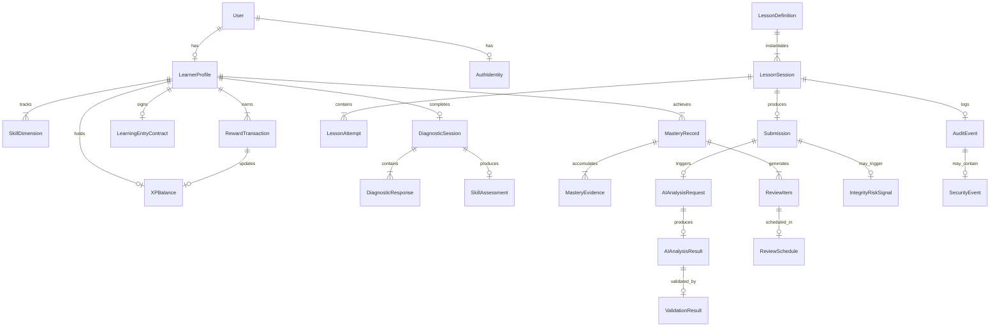

# Data Model

**Status:** Draft  
**Version:** 1.0.0  
**Last updated:** 2026-06-10

---

## Entity Relationship Diagram

---

## Core Entities

### User
**Purpose:** Core user account record
| Field | Type | Constraints | Description |
|-------|------|-------------|-------------|
| id | UUID | PK, default gen_random_uuid() | Unique user identifier |
| email | VARCHAR(255) | UNIQUE, NOT NULL | User email address |
| display_name | VARCHAR(100) | | User display name |
| status | VARCHAR(20) | NOT NULL, DEFAULT 'active' | active, suspended, deleted |
| created_at | TIMESTAMPTZ | NOT NULL, DEFAULT NOW() | Account creation time |
| updated_at | TIMESTAMPTZ | NOT NULL, DEFAULT NOW() | Last update time |
| deleted_at | TIMESTAMPTZ | | Soft delete timestamp |
**PK:** id  
**Indexes:** email (unique), status, created_at  
**Retention:** Until account deletion; soft-deleted records retained 90 days  
**Privacy:** Confidential — email is PII  
**Audit:** All status changes  
**Soft Delete:** Yes (deleted_at set, record retained 90 days)  
**Module:** identity

### AuthIdentity
**Purpose:** External authentication provider linkage
| Field | Type | Constraints | Description |
|-------|------|-------------|-------------|
| id | UUID | PK | Identity identifier |
| user_id | UUID | FK → User.id, NOT NULL | Linked user |
| provider | VARCHAR(50) | NOT NULL | supabase, google, apple |
| provider_id | VARCHAR(255) | NOT NULL | Provider-side user ID |
| created_at | TIMESTAMPTZ | NOT NULL | Linkage time |
**PK:** id  
**FK:** user_id → User.id  
**Unique:** (provider, provider_id)  
**Retention:** Until user deletion  
**Privacy:** Confidential  
**Module:** identity

### LearnerProfile
**Purpose:** Multidimensional learner profile with preferences and state
| Field | Type | Constraints | Description |
|-------|------|-------------|-------------|
| id | UUID | PK | Profile identifier |
| user_id | UUID | FK → User.id, UNIQUE, NOT NULL | Owning user |
| target_language | VARCHAR(10) | NOT NULL | e.g., 'en', 'es' |
| native_language | VARCHAR(10) | NOT NULL | e.g., 'it', 'ja' |
| cefr_self_assessment | VARCHAR(3) | | e.g., 'A2' |
| goals | JSONB | DEFAULT '{}' | Learning goals |
| interests | JSONB | DEFAULT '[]' | Interest tags |
| weekly_session_goal | INT | DEFAULT 4 | Target sessions/week |
| preferred_lesson_duration | INT | DEFAULT 15 | Minutes |
| profile_status | VARCHAR(20) | NOT NULL, DEFAULT 'active' | active, dormant, archived |
| created_at | TIMESTAMPTZ | NOT NULL | |
| updated_at | TIMESTAMPTZ | NOT NULL | |
**PK:** id  
**FK:** user_id → User.id  
**Indexes:** user_id (unique), target_language  
**Retention:** Until account deletion + 2 years  
**Privacy:** Confidential  
**Soft Delete:** No (deletes with user)  
**Module:** learner_profile

### SkillDimension
**Purpose:** Per-dimension skill tracking within a learner profile
| Field | Type | Constraints | Description |
|-------|------|-------------|-------------|
| id | UUID | PK | |
| profile_id | UUID | FK → LearnerProfile.id, NOT NULL | Owning profile |
| dimension | VARCHAR(30) | NOT NULL | reading, writing, listening, speaking, grammar, vocabulary |
| cefr_level | VARCHAR(3) | NOT NULL | A1, A2, B1, B2, C1, C2 |
| confidence | FLOAT | NOT NULL, DEFAULT 0 | 0.0 to 1.0 |
| score | INT | NOT NULL, DEFAULT 0 | Dimension score |
| created_at | TIMESTAMPTZ | NOT NULL | |
| updated_at | TIMESTAMPTZ | NOT NULL | |
**PK:** id  
**FK:** profile_id → LearnerProfile.id  
**Unique:** (profile_id, dimension)  
**Module:** learner_profile

### DiagnosticSession
**Purpose:** A single diagnostic assessment session
| Field | Type | Constraints | Description |
|-------|------|-------------|-------------|
| id | UUID | PK | |
| profile_id | UUID | FK → LearnerProfile.id, NOT NULL | |
| session_type | VARCHAR(20) | NOT NULL, DEFAULT 'initial' | initial, reassessment |
| status | VARCHAR(20) | NOT NULL, DEFAULT 'created' | created, active, completed, expired |
| current_question | INT | DEFAULT 0 | Progress tracking |
| total_questions | INT | NOT NULL | |
| started_at | TIMESTAMPTZ | | |
| completed_at | TIMESTAMPTZ | | |
| expires_at | TIMESTAMPTZ | NOT NULL | |
**PK:** id  
**Indexes:** profile_id, status, expires_at  
**State Machine:** yes  
**Module:** diagnostics

### DiagnosticResponse
**Purpose:** A single response within a diagnostic session
| Field | Type | Constraints | Description |
|-------|------|-------------|-------------|
| id | UUID | PK | |
| session_id | UUID | FK → DiagnosticSession.id, NOT NULL | |
| question_id | VARCHAR(50) | NOT NULL | Question identifier |
| dimension | VARCHAR(30) | NOT NULL | |
| response | JSONB | NOT NULL | The learner's response |
| correct | BOOLEAN | | Marked for scored questions |
| score | FLOAT | | 0.0 to 1.0 |
| created_at | TIMESTAMPTZ | NOT NULL | |
**PK:** id  
**FK:** session_id → DiagnosticSession.id  
**Indexes:** (session_id, question_id) unique  
**Module:** diagnostics

### SkillAssessment
**Purpose:** Computed skill assessment results from a diagnostic
| Field | Type | Constraints | Description |
|-------|------|-------------|-------------|
| id | UUID | PK | |
| session_id | UUID | FK → DiagnosticSession.id, UNIQUE | |
| profile_id | UUID | FK → LearnerProfile.id, NOT NULL | |
| assessments | JSONB | NOT NULL | Per-dimension results |
| overall_cefr | VARCHAR(3) | NOT NULL | |
| confidence | FLOAT | NOT NULL | Overall confidence |
| created_at | TIMESTAMPTZ | NOT NULL | |
**Module:** diagnostics

### LearningEntryContract
**Purpose:** Learner's commitment contract
| Field | Type | Constraints | Description |
|-------|------|-------------|-------------|
| id | UUID | PK | |
| profile_id | UUID | FK → LearnerProfile.id, NOT NULL | |
| target_cefr | VARCHAR(3) | NOT NULL | Goal level |
| weekly_sessions | INT | NOT NULL | Target sessions/week |
| focus_areas | JSONB | DEFAULT '[]' | Skill focus areas |
| duration_weeks | INT | NOT NULL | Contract duration |
| status | VARCHAR(20) | NOT NULL, DEFAULT 'active' | active, completed, expired, replaced |
| accepted_at | TIMESTAMPTZ | NOT NULL | |
| expires_at | TIMESTAMPTZ | NOT NULL | |
**Module:** learning_contract

### LessonDefinition
**Purpose:** Template definition for a lesson
| Field | Type | Constraints | Description |
|-------|------|-------------|-------------|
| id | UUID | PK | |
| lesson_type | VARCHAR(30) | NOT NULL | narrative, visual, audio, functional, writing |
| title | JSONB | NOT NULL | Localized title |
| description | JSONB | NOT NULL | Localized description |
| target_cefr | VARCHAR(3) | | Required level |
| estimated_duration | INT | NOT NULL | Minutes |
| content_version | VARCHAR(20) | NOT NULL | |
| is_active | BOOLEAN | DEFAULT true | |
| created_at | TIMESTAMPTZ | NOT NULL | |
**Module:** curriculum

### LessonSession
**Purpose:** A single lesson instance for a learner
| Field | Type | Constraints | Description |
|-------|------|-------------|-------------|
| id | UUID | PK | |
| profile_id | UUID | FK → LearnerProfile.id, NOT NULL | |
| lesson_id | UUID | FK → LessonDefinition.id | |
| status | VARCHAR(20) | NOT NULL, DEFAULT 'created' | created, active, paused, submitting, completed, failed, abandoned |
| lesson_type | VARCHAR(30) | NOT NULL | |
| prompt | JSONB | | Lesson prompt |
| attempt_count | INT | DEFAULT 0 | |
| started_at | TIMESTAMPTZ | | |
| completed_at | TIMESTAMPTZ | | |
| expires_at | TIMESTAMPTZ | | |
**State Machine:** yes  
**Module:** lesson_engine

### LessonAttempt
**Purpose:** A single attempt within a lesson session
| Field | Type | Constraints | Description |
|-------|------|-------------|-------------|
| id | UUID | PK | |
| session_id | UUID | FK → LessonSession.id, NOT NULL | |
| attempt_number | INT | NOT NULL | |
| attempt_type | VARCHAR(20) | NOT NULL | text, audio, dialogue |
| status | VARCHAR(20) | NOT NULL | pending, submitted, analyzing, completed, failed |
| created_at | TIMESTAMPTZ | NOT NULL | |
**Module:** lesson_engine

### Submission
**Purpose:** Learner's submitted work
| Field | Type | Constraints | Description |
|-------|------|-------------|-------------|
| id | UUID | PK | |
| session_id | UUID | FK → LessonSession.id | |
| attempt_id | UUID | FK → LessonAttempt.id | |
| profile_id | UUID | FK → LearnerProfile.id, NOT NULL | |
| submission_type | VARCHAR(20) | NOT NULL | text, audio |
| content_text | TEXT | | For text submissions |
| content_audio_ref | VARCHAR(500) | | S3 reference for audio |
| content_hash | VARCHAR(64) | | SHA-256 for dedup |
| status | VARCHAR(20) | NOT NULL | created, validated, analyzing, completed, rejected, failed |
| created_at | TIMESTAMPTZ | NOT NULL | |
**State Machine:** yes  
**Module:** submission

### AIAnalysisRequest
**Purpose:** Request record for AI analysis
| Field | Type | Constraints | Description |
|-------|------|-------------|-------------|
| id | UUID | PK | |
| submission_id | UUID | FK → Submission.id, NOT NULL | |
| prompt_version | VARCHAR(64) | NOT NULL | Prompt template hash |
| provider | VARCHAR(50) | NOT NULL | |
| model | VARCHAR(100) | NOT NULL | |
| status | VARCHAR(20) | NOT NULL, DEFAULT 'pending' | pending, processing, validating, completed, failed, rejected |
| request_tokens | INT | | Token count |
| retry_count | INT | DEFAULT 0 | |
| created_at | TIMESTAMPTZ | NOT NULL | |
**State Machine:** yes  
**Module:** ai_gateway

### AIAnalysisResult
**Purpose:** Result of AI analysis (schema-validated)
| Field | Type | Constraints | Description |
|-------|------|-------------|-------------|
| id | UUID | PK | |
| request_id | UUID | FK → AIAnalysisRequest.id, UNIQUE | |
| analysis | JSONB | NOT NULL | Structured analysis output |
| schema_version | VARCHAR(20) | NOT NULL | |
| validated | BOOLEAN | NOT NULL, DEFAULT false | |
| linguistic_pass | BOOLEAN | | |
| pedagogical_pass | BOOLEAN | | |
| created_at | TIMESTAMPTZ | NOT NULL | |
**Module:** ai_gateway

### ValidationResult
**Purpose:** Record of validation outcomes
| Field | Type | Constraints | Description |
|-------|------|-------------|-------------|
| id | UUID | PK | |
| analysis_id | UUID | FK → AIAnalysisResult.id | |
| validator_type | VARCHAR(30) | NOT NULL | schema, linguistic, pedagogical |
| passed | BOOLEAN | NOT NULL | |
| details | JSONB | | Validation details |
| created_at | TIMESTAMPTZ | NOT NULL | |
**Module:** shared (linguistic_validation, pedagogical_validation)

### MasteryRecord
**Purpose:** Mastery tracking per skill dimension
| Field | Type | Constraints | Description |
|-------|------|-------------|-------------|
| id | UUID | PK | |
| profile_id | UUID | FK → LearnerProfile.id, NOT NULL | |
| dimension | VARCHAR(30) | NOT NULL | |
| current_level | VARCHAR(3) | NOT NULL, DEFAULT 'A1' | |
| xp_in_level | INT | NOT NULL, DEFAULT 0 | |
| xp_to_next | INT | NOT NULL | |
| status | VARCHAR(20) | NOT NULL, DEFAULT 'accumulating' | accumulating, threshold_reached, level_up, confirmed |
| created_at | TIMESTAMPTZ | NOT NULL | |
| updated_at | TIMESTAMPTZ | NOT NULL | |
**State Machine:** yes  
**Module:** mastery

### MasteryEvidence
**Purpose:** Evidence supporting mastery assessment
| Field | Type | Constraints | Description |
|-------|------|-------------|-------------|
| id | UUID | PK | |
| record_id | UUID | FK → MasteryRecord.id, NOT NULL | |
| session_id | UUID | FK → LessonSession.id | |
| evidence_type | VARCHAR(30) | NOT NULL | lesson_completion, assessment, review |
| score | FLOAT | NOT NULL | |
| metadata | JSONB | | |
| created_at | TIMESTAMPTZ | NOT NULL | |
**Module:** mastery

### ReviewItem
**Purpose:** An item scheduled for spaced repetition review
| Field | Type | Constraints | Description |
|-------|------|-------------|-------------|
| id | UUID | PK | |
| profile_id | UUID | FK → LearnerProfile.id, NOT NULL | |
| item_type | VARCHAR(30) | NOT NULL | vocabulary, grammar, phrase, error |
| content | JSONB | NOT NULL | The item content |
| status | VARCHAR(20) | NOT NULL, DEFAULT 'active' | active, reviewing, mastered, expired |
| interval | INT | NOT NULL, DEFAULT 1 | Days between reviews |
| ease_factor | FLOAT | NOT NULL, DEFAULT 2.5 | SRS ease factor |
| due_at | TIMESTAMPTZ | NOT NULL | |
| reviewed_at | TIMESTAMPTZ | | |
| created_at | TIMESTAMPTZ | NOT NULL | |
**State Machine:** yes  
**Module:** review_scheduler

### ReviewSchedule
**Purpose:** Schedule entry for a review item
| Field | Type | Constraints | Description |
|-------|------|-------------|-------------|
| id | UUID | PK | |
| item_id | UUID | FK → ReviewItem.id, NOT NULL | |
| scheduled_at | TIMESTAMPTZ | NOT NULL | |
| interval | INT | NOT NULL | |
| ease_factor | FLOAT | NOT NULL | |
| created_at | TIMESTAMPTZ | NOT NULL | |
**Module:** review_scheduler

### RewardTransaction
**Purpose:** Immutable XP reward record
| Field | Type | Constraints | Description |
|-------|------|-------------|-------------|
| id | UUID | PK | |
| profile_id | UUID | FK → LearnerProfile.id, NOT NULL | |
| transaction_type | VARCHAR(30) | NOT NULL | lesson_complete, review_complete, achievement, streak_bonus |
| source_id | UUID | | ID of source (lesson, review, etc.) |
| idempotency_key | VARCHAR(64) | NOT NULL | For duplicate detection |
| xp_amount | INT | NOT NULL | Positive XP earned |
| xp_balance_after | INT | NOT NULL | Running balance |
| status | VARCHAR(20) | NOT NULL, DEFAULT 'initiated' | initiated, validated, committed, failed |
| created_at | TIMESTAMPTZ | NOT NULL | |
**State Machine:** yes  
**Unique:** (profile_id, idempotency_key)  
**Module:** reward_engine

### XPBalance
**Purpose:** Current XP balance per profile
| Field | Type | Constraints | Description |
|-------|------|-------------|-------------|
| id | UUID | PK | |
| profile_id | UUID | FK → LearnerProfile.id, UNIQUE | |
| total_xp | INT | NOT NULL, DEFAULT 0 | |
| current_streak | INT | NOT NULL, DEFAULT 0 | |
| longest_streak | INT | NOT NULL, DEFAULT 0 | |
| last_activity_date | DATE | | |
**Module:** reward_engine

### Notification
**Purpose:** Push notification record
| Field | Type | Constraints | Description |
|-------|------|-------------|-------------|
| id | UUID | PK | |
| profile_id | UUID | FK → LearnerProfile.id, NOT NULL | |
| notification_type | VARCHAR(30) | NOT NULL | review_due, streak_reminder, achievement |
| title | VARCHAR(200) | NOT NULL | |
| body | TEXT | NOT NULL | |
| read | BOOLEAN | DEFAULT false | |
| sent_at | TIMESTAMPTZ | | |
| read_at | TIMESTAMPTZ | | |
**Module:** notifications

### SecurityEvent
**Purpose:** Security-related events
| Field | Type | Constraints | Description |
|-------|------|-------------|-------------|
| id | UUID | PK | |
| event_type | VARCHAR(50) | NOT NULL | prompt_injection, xss_attempt, rate_limit_exceeded, auth_failure |
| severity | VARCHAR(20) | NOT NULL | info, warning, critical |
| user_id | UUID | FK → User.id | May be null for unauthenticated |
| ip_address | VARCHAR(45) | | |
| payload | JSONB | | Event details |
| created_at | TIMESTAMPTZ | NOT NULL | |
**Module:** integrity

### IntegrityRiskSignal
**Purpose:** Anti-cheat and integrity risk signals
| Field | Type | Constraints | Description |
|-------|------|-------------|-------------|
| id | UUID | PK | |
| user_id | UUID | FK → User.id, NOT NULL | |
| signal_type | VARCHAR(30) | NOT NULL | duplicate_submission, impossible_timing, pattern_anomaly |
| risk_score | FLOAT | NOT NULL | 0.0 to 1.0 |
| details | JSONB | | |
| created_at | TIMESTAMPTZ | NOT NULL | |
**Module:** integrity

### AuditEvent
**Purpose:** Immutable audit log
| Field | Type | Constraints | Description |
|-------|------|-------------|-------------|
| id | BIGSERIAL | PK | Sequential for ordering |
| event_id | UUID | UNIQUE, NOT NULL | |
| trace_id | UUID | NOT NULL | |
| user_id | UUID | | Pseudonymized user reference |
| action | VARCHAR(100) | NOT NULL | |
| entity_type | VARCHAR(50) | | |
| entity_id | UUID | | |
| module | VARCHAR(50) | NOT NULL | |
| details | JSONB | | |
| result | VARCHAR(20) | NOT NULL | success, failure, rejected |
| created_at | TIMESTAMPTZ | NOT NULL, DEFAULT NOW() | |
**PK:** id (BIGSERIAL for ordered IDs)  
**Indexes:** event_id (unique), user_id, action, module, created_at  
**Retention:** 3 years  
**Privacy:** Confidential — contains pseudonymized user references  
**Module:** audit

### PromptTemplateVersion
**Purpose:** Version tracking for LLM prompt templates
| Field | Type | Constraints | Description |
|-------|------|-------------|-------------|
| id | UUID | PK | |
| template_name | VARCHAR(100) | NOT NULL | |
| version | VARCHAR(20) | NOT NULL | Semantic version |
| content_hash | VARCHAR(64) | NOT NULL | SHA-256 of template |
| template_text | TEXT | NOT NULL | The prompt template |
| schema_version | VARCHAR(20) | NOT NULL | Output schema version |
| is_active | BOOLEAN | DEFAULT false | |
| created_at | TIMESTAMPTZ | NOT NULL | |
**Unique:** (template_name, version)  
**Module:** ai_gateway

### ContentVersion
**Purpose:** Version tracking for lesson content
| Field | Type | Constraints | Description |
|-------|------|-------------|-------------|
| id | UUID | PK | |
| content_id | VARCHAR(100) | NOT NULL | Content identifier |
| version | VARCHAR(20) | NOT NULL | |
| content_hash | VARCHAR(64) | NOT NULL | |
| metadata | JSONB | | |
| is_active | BOOLEAN | DEFAULT false | |
| created_at | TIMESTAMPTZ | NOT NULL | |
**Module:** content
