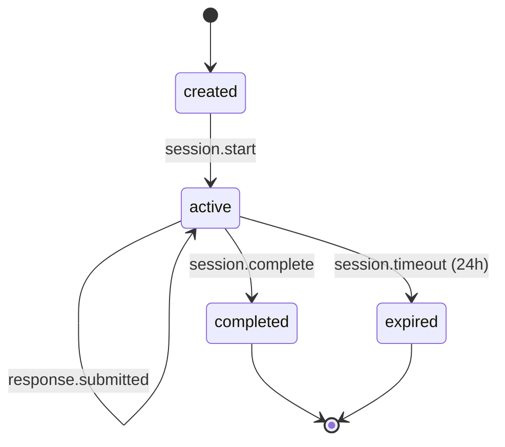
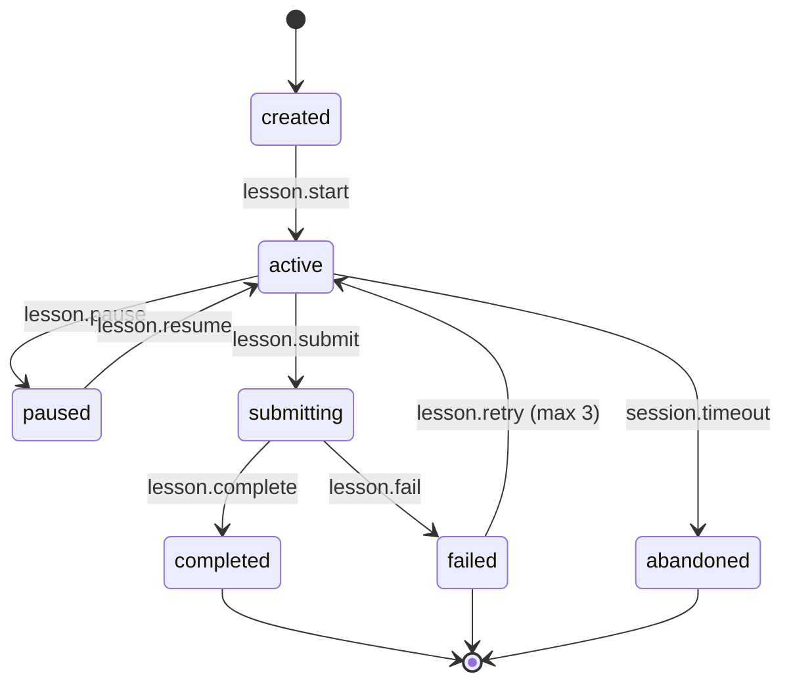
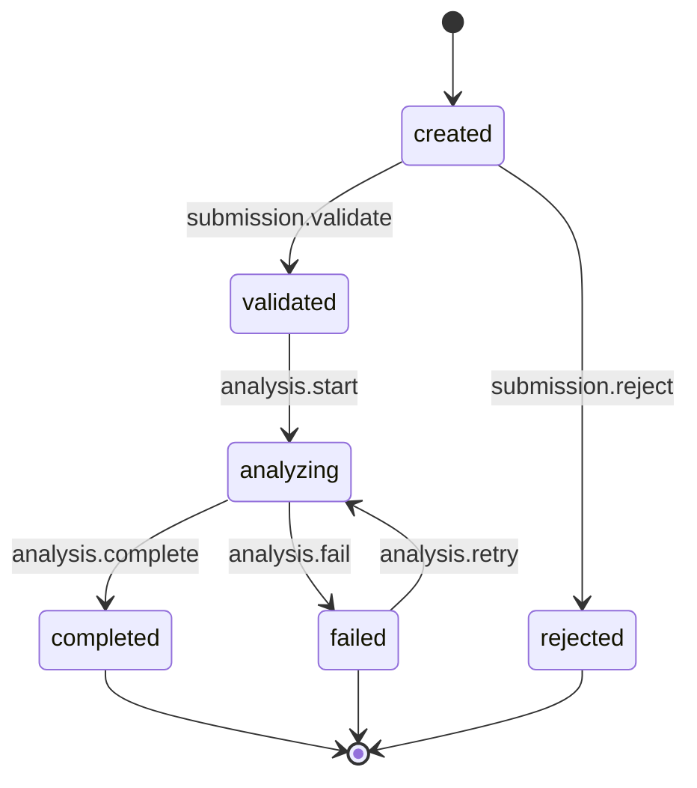
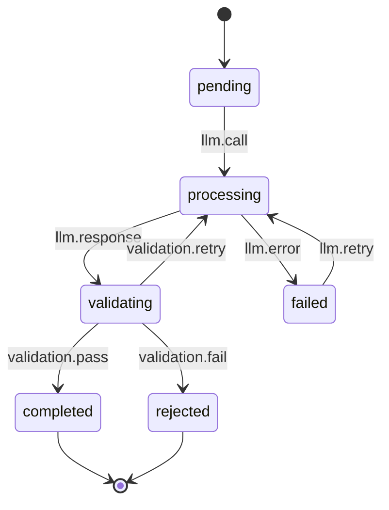
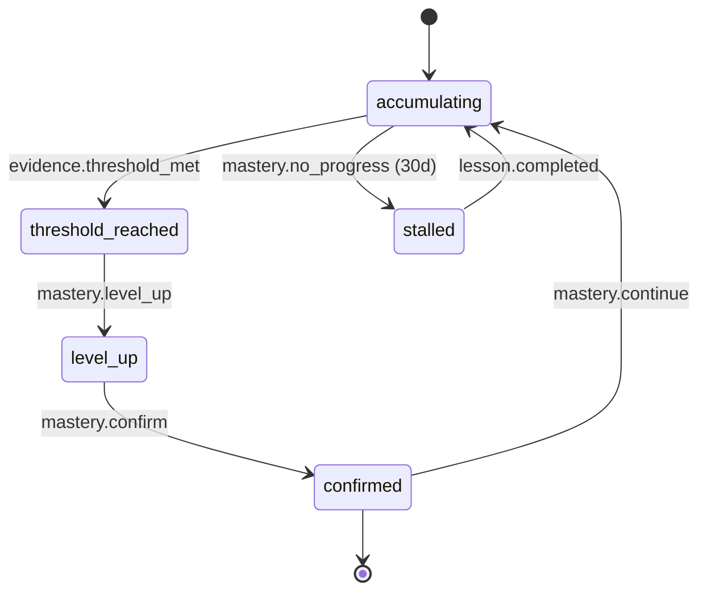
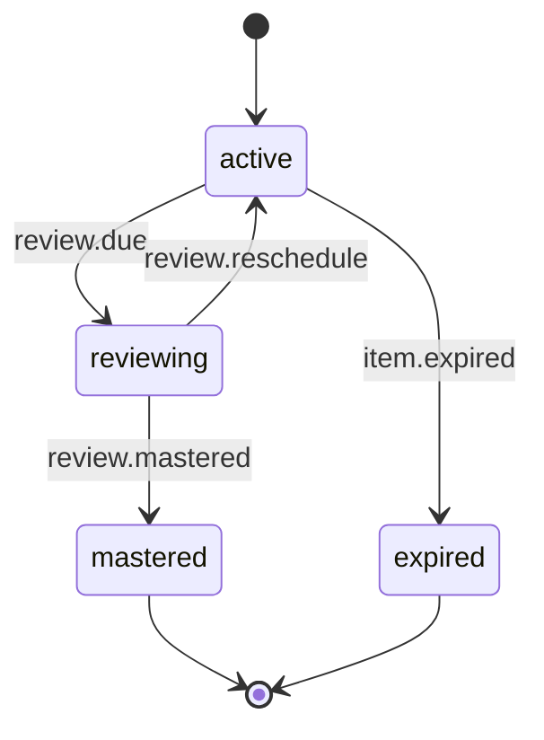
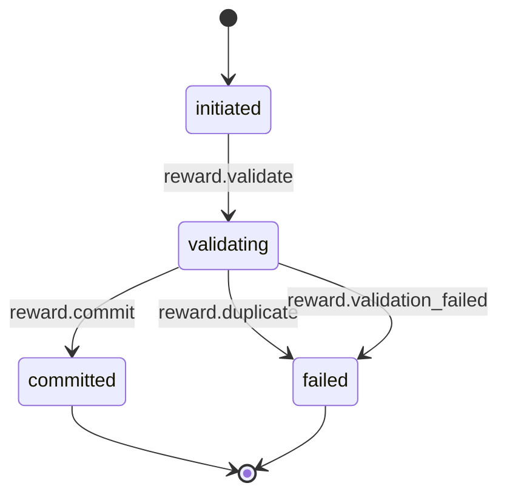

# State Machines

**Status:** Draft  
**Version:** 1.0.0  
**Last updated:** 2026-06-10

---

## 1. DiagnosticSession

### States
- `created` — Session initialized, not yet started
- `active` — Learner is answering questions
- `completed` — All questions answered, assessment computed
- `expired` — Session expired (24h timeout without completion)

### State Diagram

### Transitions

| From | Event | Guard | To | Side Effects | Audit Event | Retry Rule |
|------|-------|-------|----|-------------|-------------|------------|
| created | session.start | profile exists | active | Set started_at | diagnostic.started | no_retry |
| active | response.submitted | response valid | active | Store response, advance question | diagnostic.response_recorded | no_retry |
| active | session.complete | sufficient_evidence | completed | Compute assessment | diagnostic.completed | no_retry |
| active | session.timeout | age > 24h | expired | Release resources | diagnostic.expired | no_retry |

### Forbidden Transitions
- created → completed (skip diagnostic questions)
- expired → active (must start new session)

---

## 2. LessonSession

### States
- `created` — Session initialized
- `active` — Learner is working on the lesson
- `paused` — Learner paused session (max 24h pause)
- `submitting` — Submission is being processed through pipeline
- `completed` — Lesson successfully completed
- `failed` — Lesson failed (max retries exceeded)
- `abandoned` — Session abandoned (48h inactivity)

### State Diagram

### Transitions

| From | Event | Guard | To | Side Effects | Audit Event | Retry Rule |
|------|-------|-------|----|-------------|-------------|------------|
| created | lesson.start | valid lesson | active | Set started_at | lesson_session.started | no_retry |
| active | lesson.pause | age < 24h | paused | Persist progress | lesson_session.paused | no_retry |
| paused | lesson.resume | age < 48h | active | Restore progress | lesson_session.resumed | no_retry |
| active | lesson.submit | valid input | submitting | Create submission | lesson_session.submitted | no_retry |
| submitting | lesson.complete | all gates pass | completed | Mastery, review, reward | lesson_session.completed | no_retry |
| submitting | lesson.fail | validation fails, max retries | failed | Record failure | lesson_session.failed | retry_gate |
| failed | lesson.retry | retry_count < 3, retry_gate | active | Reset attempt | lesson_session.retried | max_3 |
| active | session.timeout | age > 48h | abandoned | Release | lesson_session.abandoned | no_retry |

### Forbidden Transitions
- created → completed (no work done)
- paused → submitting (must be active)
- failed → completed (must retry)

---

## 3. Submission

### States
- `created` — Initial state
- `validated` — Input validation passed (security, schema)
- `analyzing` — AI analysis in progress
- `completed` — Analysis complete and accepted
- `rejected` — Input rejected (security flag, invalid format)
- `failed` — Analysis failed (all retries exhausted)

### State Diagram

### Transitions

| From | Event | Guard | To | Side Effects | Audit Event |
|------|-------|-------|----|-------------|-------------|
| created | submission.validate | security scan pass | validated | Store normalized text | submission.validated |
| created | submission.reject | security flag | rejected | Create SecurityEvent | submission.rejected |
| validated | analysis.start | context bound | analyzing | Create AIAnalysisRequest | analysis.started |
| analyzing | analysis.complete | validation pass | completed | Store AIAnalysisResult | analysis.completed |
| analyzing | analysis.fail | retries exhausted | failed | Log error | analysis.failed |
| failed | analysis.retry | retry_gate | analyzing | Increment retry | analysis.retried |

### Forbidden Transitions
- rejected → analyzing (must resubmit)
- completed → analyzing (already done)

---

## 4. AIAnalysisRequest

### States
- `pending` — Request queued
- `processing` — LLM call in progress
- `validating` — Output being validated
- `completed` — Analysis accepted
- `failed` — Analysis failed (retries exhausted)
- `rejected` — Output rejected by validation

### State Diagram

### Transitions

| From | Event | Guard | To | Side Effects | Audit Event |
|------|-------|-------|----|-------------|-------------|
| pending | llm.call | provider available | processing | Track start time | ai_call.started |
| processing | llm.response | response received | validating | Track tokens, latency | ai_call.completed |
| processing | llm.error | error classified | failed | Log error | ai_call.failed |
| validating | validation.pass | all validators pass | completed | Store result | ai_analysis.validated |
| validating | validation.fail | validator fails | rejected | Log rejection reason | ai_analysis.rejected |
| validating | validation.retry | retry_gate | processing | Increment retry | ai_analysis.retrying |
| failed | llm.retry | retry_count < max | processing | Fallback if needed | ai_call.retried |

### Forbidden Transitions
- pending → completed (skip LLM call)
- rejected → completed (must regenerate)

---

## 5. MasteryRecord

### States
- `accumulating` — Collecting evidence towards next level
- `threshold_reached` — Sufficient evidence accumulated, level-up pending confirmation
- `level_up` — Level increased
- `confirmed` — New level confirmed, accumulating towards next
- `stalled` — No progress for extended period (30 days)

### State Diagram

### Transitions

| From | Event | Guard | To | Audit Event |
|------|-------|-------|----|-------------|
| accumulating | evidence.threshold_met | xp >= xp_to_next | threshold_reached | mastery.threshold_reached |
| threshold_reached | mastery.level_up | deterministic | level_up | mastery.level_up |
| level_up | mastery.confirm | auto | confirmed | mastery.confirmed |
| confirmed | mastery.continue | next level | accumulating | mastery.continue |
| accumulating | mastery.no_progress | 30d no activity | stalled | mastery.stalled |
| stalled | lesson.completed | lesson done | accumulating | mastery.reactivated |

### Forbidden Transitions
- accumulating → level_up (skip threshold)
- threshold_reached → accumulating (regression not supported)

---

## 6. ReviewItem

### States
- `active` — Item scheduled for future review
- `reviewing` — Item is currently being reviewed
- `mastered` — Item has reached mastery (interval >= 180 days)
- `expired` — Item expired (removed from active rotation)

### State Diagram

### Transitions

| From | Event | Guard | To | Side Effects | Audit Event |
|------|-------|-------|----|-------------|-------------|
| active | review.due | due_at <= now | reviewing | Load item | review.started |
| reviewing | review.reschedule | scored | active | Update SRS interval | review.scheduled |
| reviewing | review.mastered | interval >= 180d | mastered | Update mastery hint | review.mastered |
| active | item.expired | retention exceeded | expired | Remove from rotation | review.expired |

---

## 7. RewardTransaction

### States
- `initiated` — Transaction started
- `validating` — Idempotency and duplicate checks
- `committed` — XP awarded and ledger updated
- `failed` — Transaction failed (duplicate, validation error)

### State Diagram

### Transitions

| From | Event | Guard | To | Side Effects | Audit Event |
|------|-------|-------|----|-------------|-------------|
| initiated | reward.validate | idempotency_key valid | validating | — | reward.initiated |
| validating | reward.commit | no duplicate, checks pass | committed | Update XPBalance | reward.committed |
| validating | reward.duplicate | duplicate detected | failed | Log IntegrityRiskSignal | reward.duplicate_blocked |
| validating | reward.validation_failed | validation error | failed | Log error | reward.failed |

### Forbidden Transitions
- initiated → committed (skip validation)
- failed → committed (cannot revalidate)
