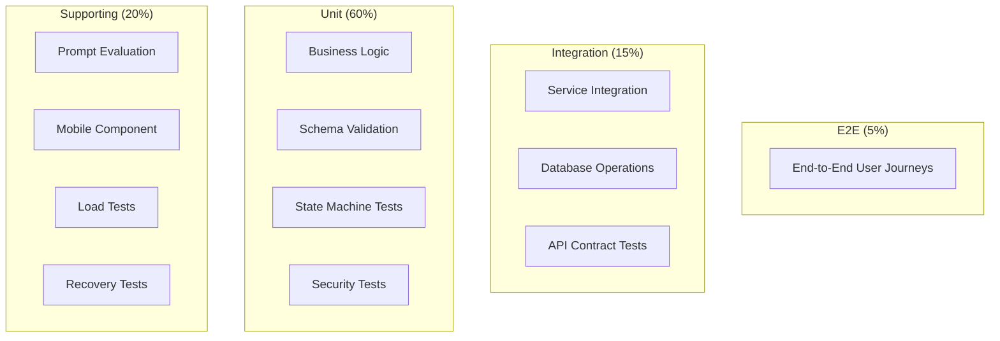

# Testing Strategy

**Status:** Draft  
**Version:** 1.0.0  
**Last updated:** 2026-06-10

---

## Test Pyramid

---

## Test Layers

### 1. Unit Tests
**Framework:** pytest (backend), Jest (mobile)  
**Coverage Target:** > 80% backend, > 60% mobile

- Business logic for all modules
- Input normalization and sanitization
- Deterministic scoring algorithms
- SRS scheduling calculation
- XP and reward calculation
- Achievement milestone detection

### 2. Schema Tests
**Framework:** JSON Schema validation + Pydantic  
**Coverage:** All request/response schemas

- Every API request body matches its schema
- Every API response body matches its schema
- Error responses match error schema
- LLM output schemas validate correctly
- Invalid inputs produce correct validation errors

### 3. Contract Tests
**Framework:** PACT or custom API contract tests  
**Coverage:** All API endpoints

- API returns correct status codes
- API returns correct response structure
- API respects authentication requirements
- API supports idempotency keys
- Rate limiting headers present

### 4. Integration Tests
**Framework:** pytest + async test client + test database  
**Coverage:** Module interactions

- Lesson creation → submission → analysis → completion flow
- Diagnostic session → responses → assessment computation
- Review item creation → scheduling → attempt processing
- Reward transaction → ledger update
- Audit event recording

### 5. State Machine Tests
**Framework:** pytest parametrize  
**Coverage:** All entity state machines

**Required test patterns for each state machine:**
- Valid transitions: test all allowed transitions
- Invalid transitions: verify forbidden transitions raise errors
- State persistence: verify state changes are persisted correctly
- Concurrent transitions: verify race conditions handled

### 6. Security Tests
**Framework:** pytest + custom security test suite  
**Coverage:** All security controls

- Authentication bypass attempts
- IDOR (Insecure Direct Object Reference) — automated for all endpoints
- Prompt injection — test suite with 50+ injection patterns
- SQL injection — automated scan
- XSS — automated scan
- Rate limit enforcement

### 7. Prompt Evaluation
**Framework:** Custom test harness  
**Coverage:** All prompt templates

- Injection resistance (direct, roleplay, payload)
- Output schema conformance
- Content policy compliance
- Instruction adherence
- Level appropriateness

### 8. Mobile Component Tests
**Framework:** Jest + React Native Testing Library  
**Coverage:** Key mobile components

- Form rendering and validation
- Lesson display components
- Audio recording controls
- Navigation flows
- Error state rendering

### 9. E2E Tests
**Framework:** Detox (mobile) or Playwright  
**Coverage:** Critical user journeys

- Full onboarding + diagnostic flow
- Lesson session lifecycle
- Review session
- Error handling and recovery

### 10. Load Tests
**Framework:** Locust  
**Coverage:** API under simulated load

- Sustained load: 100 concurrent users for 30 minutes
- Burst load: 200 concurrent users for 5 minutes
- AI endpoint simulation (mock AI responses)
- Database connection pool behavior under load

### 11. Recovery Tests
**Framework:** Custom scripts + Docker Compose  
**Coverage:** Failure scenarios

- Database restart during lesson submission
- AI provider timeout and fallback
- Redis failure and recovery
- Storage service unavailability

---

## Required Test Scenarios

### Scenario 1: Diagnostic Completion
**Type:** Integration + E2E  
**Steps:** Create diagnostic session → submit responses across all dimensions → complete session → verify assessment computed  
**Expected:** Assessment covers all dimensions, confidence > 0.5

### Scenario 2: Lesson Creation
**Type:** Integration  
**Steps:** Fetch available lessons → start lesson session → verify lesson prompt delivered  
**Expected:** Session created in 'active' state with valid prompt

### Scenario 3: Valid Submission
**Type:** Integration + Contract  
**Steps:** Create lesson → submit valid text → verify pipeline runs → verify feedback returned  
**Expected:** Submission accepted, analysis returned, XP awarded

### Scenario 4: Invalid Submission
**Type:** Security + Integration  
**Steps:** Submit empty string → submit excessively long text → submit non-UTF-8 characters  
**Expected:** Rejected with appropriate validation error

### Scenario 5: Provider Timeout
**Type:** Recovery  
**Steps:** Mock AI provider to timeout → submit lesson → observe retry → observe fallback → verify user notified  
**Expected:** Retry gate triggers fallback, user receives degraded but acceptable feedback

### Scenario 6: Malformed LLM JSON
**Type:** Schema + Recovery  
**Steps:** Mock AI provider to return invalid JSON → submit lesson → observe schema validation failure → verify retry  
**Expected:** Schema validation fails, retry gate allows regeneration, second attempt succeeds

### Scenario 7: Pedagogical Rejection
**Type:** Integration  
**Steps:** Submit low-quality content → verify pedagogical validation fails → verify retry gate → submit improved content → verify acceptance  
**Expected:** First attempt rejected pedagogically, retry allowed, improved attempt accepted

### Scenario 8: Duplicate Attempt
**Type:** Security + State Machine  
**Steps:** Submit lesson → submit same request with same idempotency key → verify second request returns same result → no duplicate XP  
**Expected:** Idempotent response, single XP award

### Scenario 9: Duplicate Reward
**Type:** Security  
**Steps:** Complete lesson → intercept reward transaction → replay reward request with new idempotency key → verify rejection  
**Expected:** Second reward attempt rejected, IntegrityRiskSignal logged

### Scenario 10: Cross-User Access
**Type:** Security  
**Steps:** Authenticate as User A → attempt to access User B's profile, submissions, rewards → verify rejection  
**Expected:** All cross-user access attempts return 403 or 404

### Scenario 11: Review Due Calculation
**Type:** Unit + Integration  
**Steps:** Create review items with various due dates → query due reviews → verify correct items returned  
**Expected:** Items with due_at <= now returned, ordered by priority

### Scenario 12: Failed Retry Gate
**Type:** State Machine + Integration  
**Steps:** Submit lesson → fail validation → retry → fail 3 times → verify session marked as failed → verify retry gate blocks further retries  
**Expected:** After 3 retries, session fails, no further retries allowed

### Scenario 13: Audit Completeness
**Type:** Integration  
**Steps:** Complete full lesson pipeline → query audit events → verify all steps recorded → verify required fields present  
**Expected:** Every pipeline step has corresponding audit event, all required fields populated
